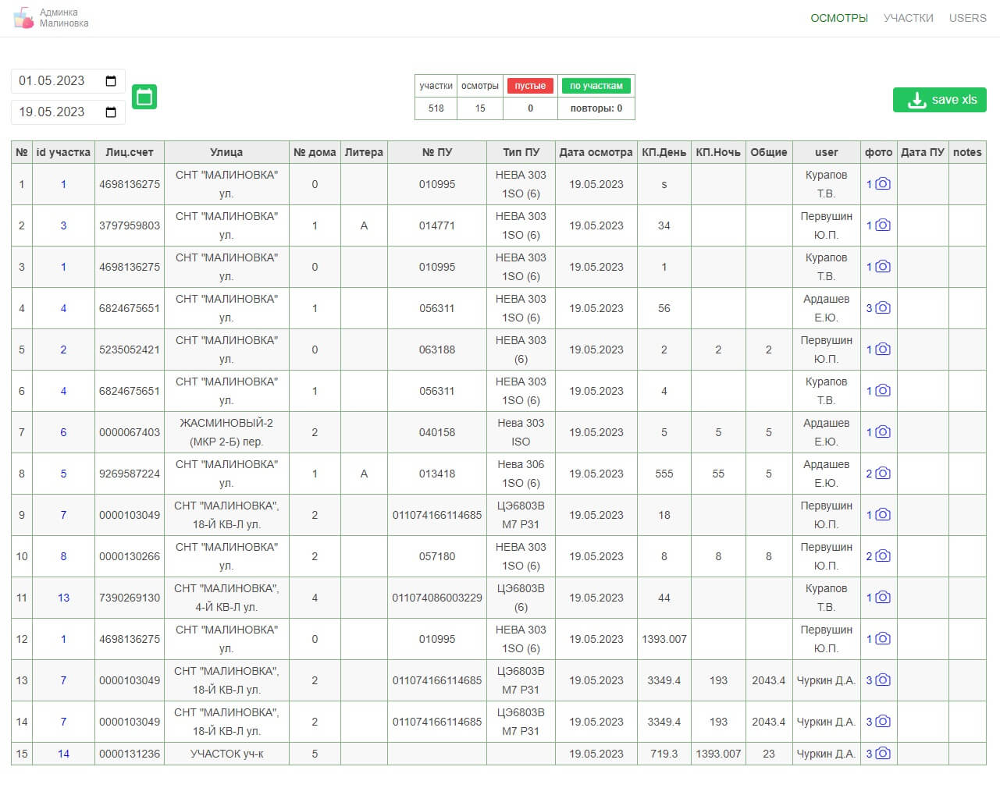
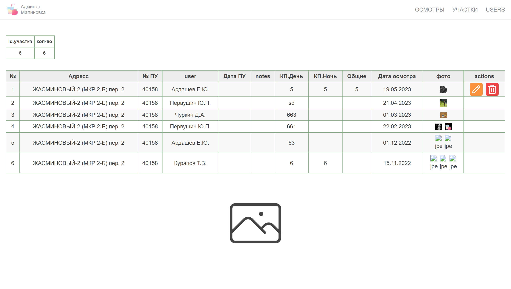
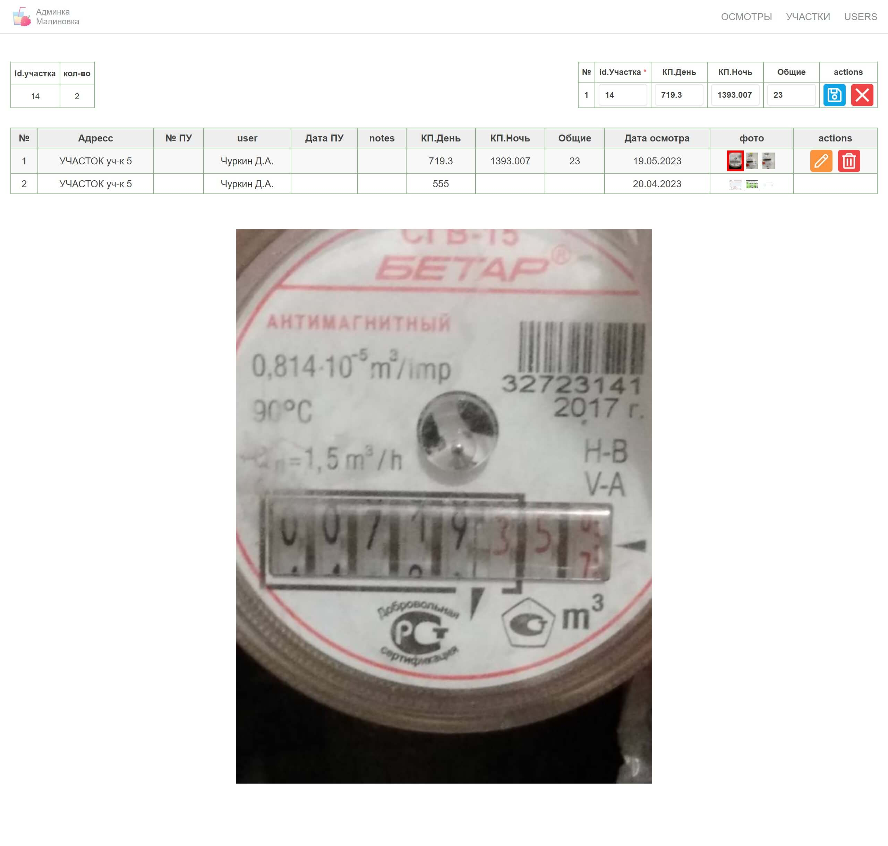
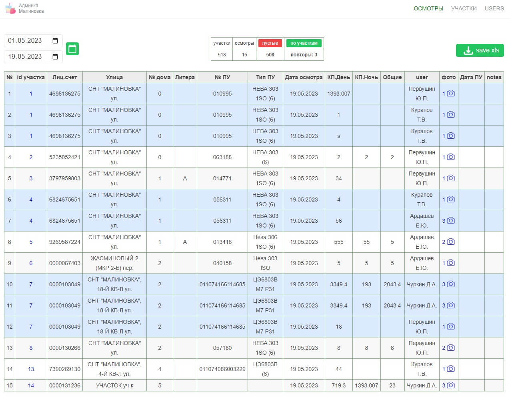
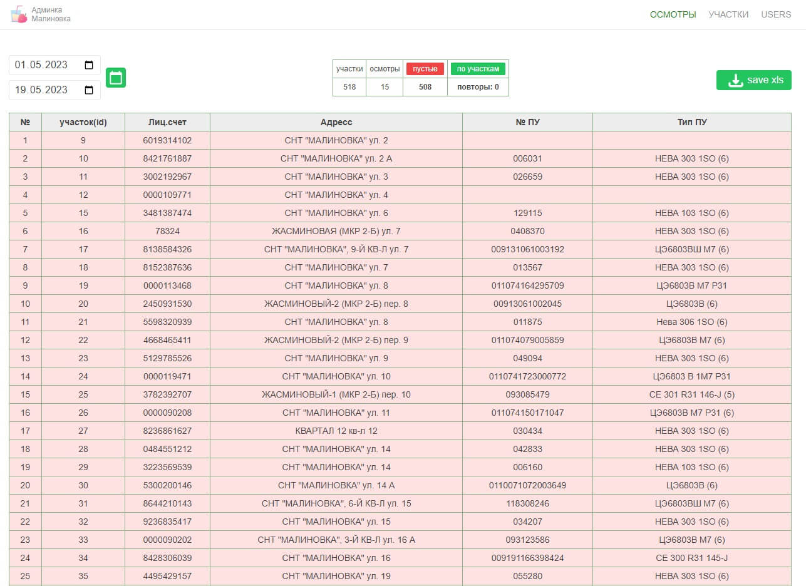
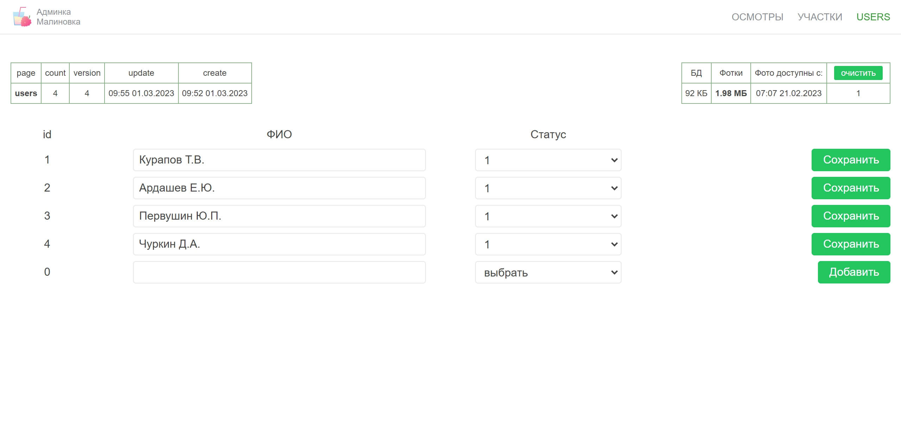
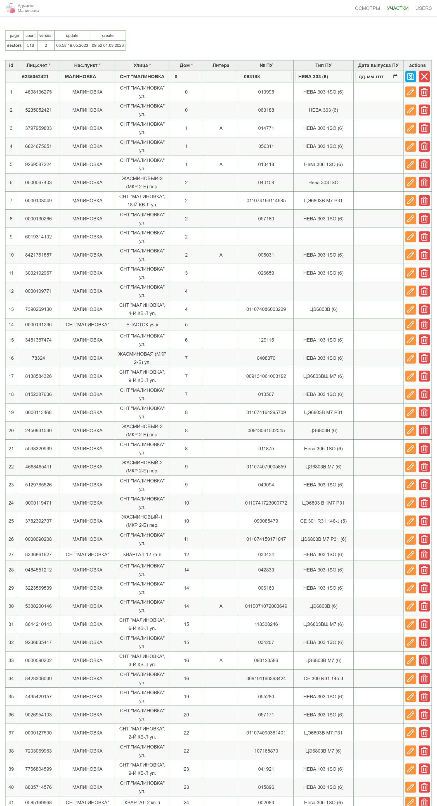

#### malinovkaAdminka - api и админка для мобильного приложения (pwa) [malinovkaPWA](https://github.com/dsa25/malinovkaPWA)

### Stack:
- fastify (веб-фреймворк для Node.js)
- sqlite (БД)
- sequelize (использую для синхронизации моделей в БД sqlite)
- vue
- vue-router
- tailwindcss
- vite
</br>

### steps:
- git clone ...
- npm install
- create file: .env 
```js
PORT=5004
IP=localhost
```
- **create file: .env.production // - ** из-за alias не собрался на ubuntu =)
```js
VITE_BASE_URL=https://malinovka.example.ru
```
- npm run build // на windows =)
- папку /dist - отправляем в корень на сервер
- в файле migrate.js раскомментируем все модели и 'npm run migrate' // - создаем пустые таблицы в БД
- 'npm run start'   или   'pm2 start malinovka.js'
</br>

#### Screenshots:

<table>
  <tr>
    <td  valign="top">Список осмотров и история по участку </td>
    <td>
      
      
      
    </td>
  </tr>
  <tr>
     <td valign="top">Фильтры по осмотрам</td>
     <td>
       
       
    </td>
  </tr>
  <tr>
    <td  valign="top">Пользователи</td>
    <td></td>
  </tr>
  <tr>
    <td  valign="top">Участки</td>
    <td>
      
    </td>
  </tr>
</table>
